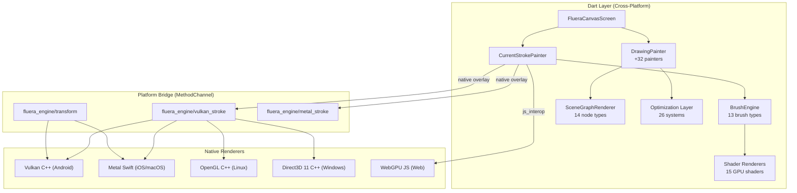
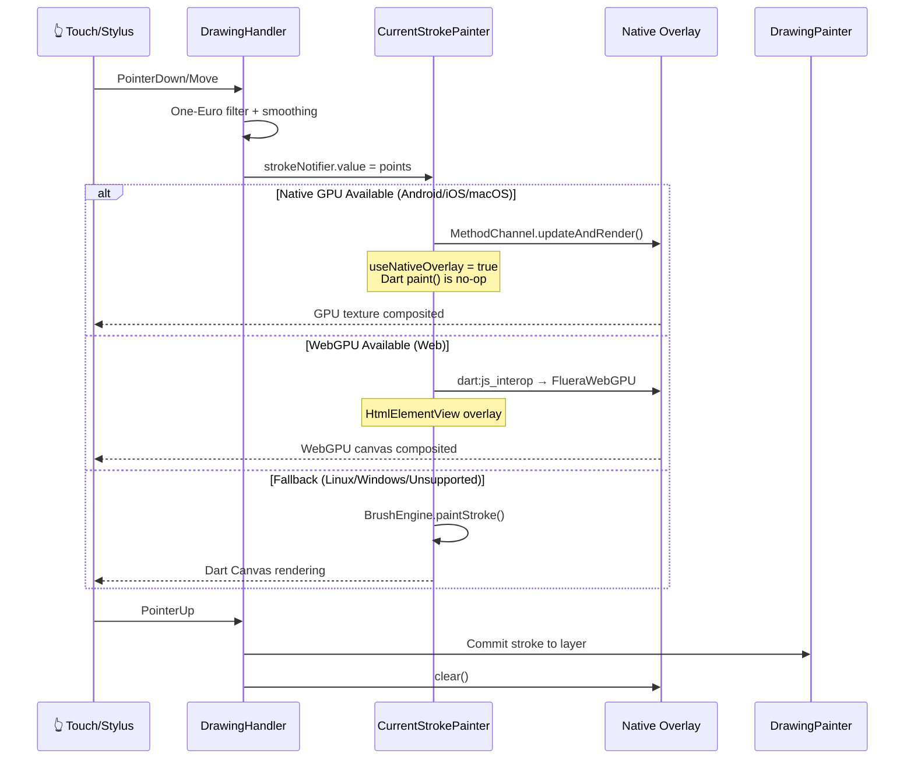
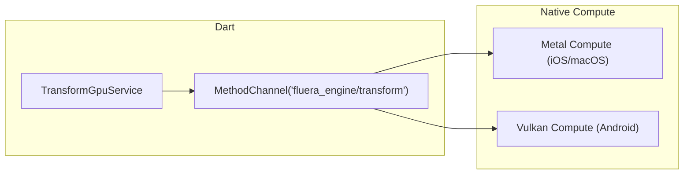
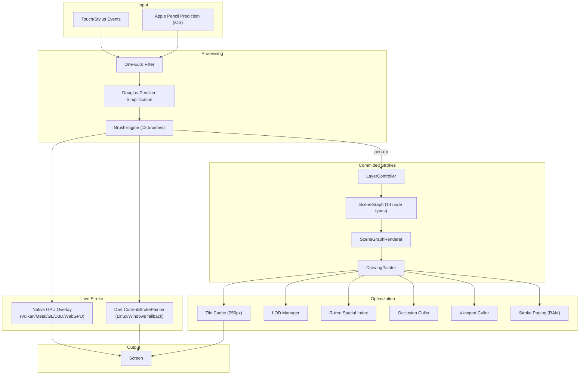

# Fluera Engine — Multi-Platform Architecture

> Come il sistema canvas funziona su **6 piattaforme** con **6 renderer GPU** e come si collegano tra loro.

---

## Panoramica



---

## Architettura a Strati

### 1. Canvas Layer (`lib/src/canvas/`)

Il punto di ingresso è `FlueraCanvasScreen` — un unico `StatefulWidget` con **~18 part files** che separano le responsabilità:

| Part File | Responsabilità |
|---|---|
| `_drawing_handlers.dart` | Input handling, gesture → stroke pipeline |
| `_voice_recording.dart` | Audio recording sync con strokes |
| `_collaboration.dart` | Real-time multi-user via WebSocket |
| `_cloud_sync.dart` | Firebase/cloud save + asset download |
| `_pdf_features.dart` | PDF import, annotation, reader mode |
| `_ui_toolbar.dart` | Toolbar UI + export pipelines |
| `_advanced_export.dart` | .fluera format, raster, tokens |
| `_latex_recognition_handler.dart` | Handwriting → LaTeX OCR |
| `lifecycle/_lifecycle_helpers.dart` | Layer callbacks, image loading, cluster detection |
| `lifecycle/_lifecycle_time_travel.dart` | Time travel recorder/playback |

### 2. Rendering Layer (`lib/src/rendering/`)

```
rendering/
├── canvas/          → 32 CustomPainters (drawing, images, PDF, shapes, rulers...)
├── scene_graph/     → SceneGraphRenderer + 14 node-specific renderers
├── gpu/             → Platform bridge services (Vulkan, Metal, WebGPU, Transform)
├── shaders/         → 15 GLSL fragment shader renderers (pencil, charcoal, watercolor...)
├── optimization/    → 26 systems (spatial index, LOD, tiling, occlusion, memory budget...)
└── cache/           → Render caching infrastructure
```

### 3. Drawing Layer (`lib/src/drawing/`)

```
drawing/
├── brushes/         → 13 brush implementations
│   ├── brush_engine.dart        → Core engine (50KB) - routing + compositing
│   ├── ballpoint_brush.dart     → Uniform width, smooth curves
│   ├── pencil_brush.dart        → Pressure-sensitive, grain texture
│   ├── fountain_pen_brush.dart  → Calligraphic nib, tilt-aware
│   ├── highlighter_brush.dart   → Transparent overlay
│   ├── marker_brush.dart        → Chisel tip, flat strokes
│   ├── charcoal_brush.dart      → Rough texture, smudge
│   ├── watercolor_brush.dart    → Wet edge, bleed effect
│   └── technical_pen_brush.dart → Uniform width, CAD-style
├── models/          → ProStroke, ProDrawingPoint, ProBrushSettings
└── filters/         → One-Euro filter, predictive renderer
```

---

## Live Stroke Pipeline — Per Piattaforma

Il live stroke è il percorso più critico per la latenza. Ogni piattaforma ha un **renderer nativo** dedicato che bypassa il rendering Dart durante il disegno attivo.

### Flusso Comune (Dart)



---

## 📱 Android — Vulkan

```
┌──────────────────────────────────────────────┐
│ Dart                                          │
│  VulkanStrokeOverlayService                   │
│  MethodChannel('fluera_engine/vulkan_stroke')  │
└──────────────┬───────────────────────────────┘
               │ MethodChannel
┌──────────────▼───────────────────────────────┐
│ Kotlin                                        │
│  VulkanStrokeOverlayPlugin.kt                 │
│  SurfaceTexture → FlutterTextureRegistry      │
└──────────────┬───────────────────────────────┘
               │ JNI
┌──────────────▼───────────────────────────────┐
│ C++ (vk_jni_bridge.cpp)                       │
│  └─ VkStrokeRenderer                         │
│     ├─ Vulkan Device + Swapchain              │
│     ├─ SPIR-V vertex/fragment shaders         │
│     ├─ Tessellation pipeline (CPU → GPU)      │
│     ├─ 8× MSAA anti-aliasing                 │
│     └─ Per-brush rendering modes              │
│        (ballpoint, pencil, fountain pen)       │
└──────────────────────────────────────────────┘
```

**Files**:
- `android/src/main/cpp/vk_stroke_renderer.cpp` (80KB) — Core Vulkan renderer
- `android/src/main/cpp/vk_jni_bridge.cpp` — JNI bridge
- `android/src/main/cpp/vk_shaders.h` — Embedded SPIR-V bytecode
- `android/src/main/cpp/shaders/` — GLSL sources

**Texture Sharing**: `SurfaceTexture` → `FlutterTextureRegistry.registerTexture()` → `Texture(textureId:)` widget

---

## 🍎 iOS — Metal

```
┌──────────────────────────────────────────────┐
│ Dart                                          │
│  VulkanStrokeOverlayService ← same service!   │
│  MethodChannel('fluera_engine/vulkan_stroke')  │
└──────────────┬───────────────────────────────┘
               │ MethodChannel
┌──────────────▼───────────────────────────────┐
│ Swift                                         │
│  MetalStrokeOverlayPlugin                     │
│  implements FlutterTexture (copyPixelBuffer)  │
│  └─ MetalStrokeRenderer (52KB)               │
│     ├─ MTLDevice + MTLCommandQueue            │
│     ├─ StrokeShaders.metal (vertex+fragment)  │
│     ├─ Tessellation pipeline (CPU → GPU)      │
│     ├─ 4× MSAA anti-aliasing                 │
│     ├─ CVPixelBuffer-backed MTLTexture        │
│     └─ Per-brush rendering modes              │
└──────────────────────────────────────────────┘
```

**Files**:
- `ios/Classes/MetalStrokeRenderer.swift` (53KB) — Core Metal renderer
- `ios/Classes/MetalStrokeOverlayPlugin.swift` — Flutter plugin bridge
- `ios/Classes/StrokeShaders.metal` — MSL vertex/fragment shaders

**Texture Sharing**: `CVPixelBuffer` → `FlutterTexture.copyPixelBuffer()` → `Texture(textureId:)` widget

**Plugin Extra** (iOS-only):
| Plugin | Funzione |
|---|---|
| `PredictedTouchPlugin` | Apple Pencil prediction API |
| `AudioRecorderPlugin` | AVAudioEngine recording |
| `AudioPlayerPlugin` | AVAudioPlayer playback |
| `PdfRendererPlugin` | CGPDFDocument native rendering |
| `LatexRecognizerPlugin` | On-device LaTeX recognition |
| `DisplayLinkPlugin` | CADisplayLink 120Hz sync |
| `VibrationPlugin` | Core Haptics engine |
| `PerformanceMonitorPlugin` | CPU/GPU/memory metrics |
| `PrintPlugin` | UIPrintInteractionController |

---

## 🖥️ macOS — Metal

Stessa architettura di iOS, con MetalStrokeRenderer identico:

```
macos/Classes/
├── MetalStrokeRenderer.swift      (53KB — identical to iOS)
├── MetalStrokeOverlayPlugin.swift (platform-adapted bridge)
└── StrokeShaders.metal
```

**Differenza**: usa `FlutterPluginRegistrar` di macOS. Nessun `PredictedTouch` (non c'è Apple Pencil su Mac).

---

## 🐧 Linux — OpenGL

```
┌──────────────────────────────────────────────┐
│ Dart                                          │
│  VulkanStrokeOverlayService ← same service!   │
│  MethodChannel('fluera_engine/vulkan_stroke')  │
└──────────────┬───────────────────────────────┘
               │ MethodChannel
┌──────────────▼───────────────────────────────┐
│ C++ (gl_stroke_overlay_plugin.cc)             │
│  FlutterTextureRegistrar API                  │
│  └─ GlStrokeRenderer (17KB)                  │
│     ├─ EGL context + FBO                      │
│     ├─ GLSL vertex/fragment shaders           │
│     ├─ Tessellation pipeline                  │
│     ├─ 4× MSAA via glRenderbufferStorage MS   │
│     └─ Per-brush rendering modes              │
└──────────────────────────────────────────────┘
```

**Files**:
- `linux/gl_stroke_renderer.cpp` (17KB) — GL 3.3 renderer
- `linux/gl_stroke_overlay_plugin.cc` (16KB) — Flutter embedder bridge

**Texture Sharing**: `GL_TEXTURE_2D` → `FlutterDesktopTextureRegistrarMarkExternalTextureFrameAvailable()` → `Texture(textureId:)` widget

---

## 🪟 Windows — Direct3D 11

```
┌──────────────────────────────────────────────┐
│ Dart                                          │
│  VulkanStrokeOverlayService ← same service!   │
│  MethodChannel('fluera_engine/vulkan_stroke')  │
└──────────────┬───────────────────────────────┘
               │ MethodChannel
┌──────────────▼───────────────────────────────┐
│ C++ (d3d11_stroke_overlay_plugin.cpp)        │
│  FlutterTextureRegistrar API                  │
│  └─ D3D11StrokeRenderer (15KB)               │
│     ├─ ID3D11Device + SwapChain               │
│     ├─ HLSL vertex/pixel shaders              │
│     ├─ Tessellation pipeline                  │
│     ├─ 4× MSAA via ID3D11Texture2D            │
│     └─ Per-brush rendering modes              │
└──────────────────────────────────────────────┘
```

**Files**:
- `windows/d3d11_stroke_renderer.cpp` (15KB) — D3D11 renderer
- `windows/d3d11_stroke_overlay_plugin.cpp` (12KB) — Flutter embedder bridge

---

## 🌐 Web — WebGPU

```
┌──────────────────────────────────────────────┐
│ Dart (runs in browser)                        │
│  WebGpuStrokeOverlayService                   │
│  dart:js_interop → window.FlueraWebGPU.*      │
└──────────────┬───────────────────────────────┘
               │ JS interop
┌──────────────▼───────────────────────────────┐
│ JavaScript (webgpu_stroke_renderer.js)        │
│  └─ FlueraWebGPU                             │
│     ├─ GPUDevice + GPUCanvasContext           │
│     ├─ WGSL vertex/fragment shaders           │
│     ├─ Tessellation pipeline (CPU → GPU)      │
│     ├─ 4× MSAA anti-aliasing                 │
│     ├─ Pre-multiplied alpha compositing       │
│     └─ Per-brush rendering modes              │
│        (ballpoint, pencil, fountain pen)       │
└──────────────────────────────────────────────┘
```

**Files**:
- `Fluera/web/webgpu_stroke_renderer.js` (~10KB) — JS WebGPU renderer
- `Fluera/web/webgpu_shaders.wgsl` (~1KB) — WGSL vertex/fragment shaders
- `lib/src/rendering/gpu/webgpu_stroke_overlay_service.dart` (~7KB) — Dart JS interop bridge
- `lib/src/rendering/gpu/webgpu_overlay_view.dart` — `HtmlElementView` widget

**Canvas Sharing**: `<canvas>` con WebGPU context → `HtmlElementView` → Flutter widget tree

**Compatibilità browser**:
- ✅ Chrome 113+ / Edge 113+
- ✅ Firefox 130+
- ✅ Safari 18+
- ⚠️ Browser non-WebGPU → fallback automatico a Dart Canvas API

**Web-specific adaptations**:
- `dart:io` protetto con `kIsWeb` guards
- `compute()` al posto di `Isolate.run()` (web-compatible)
- `FilePicker` con `withData: true` per byte-level file access

---

## 🎛️ Transform GPU — Compute Shaders

Il sistema di trasformazione (Liquify, Smudge, Warp) usa un canale separato:



| Operazione | Input | Output |
|---|---|---|
| **Liquify** | `DisplacementField` (Float32List) | Deformed texture |
| **Smudge** | `SmudgeSampleData[]` (8 floats each) | Smeared texture |
| **Warp** | `WarpMesh` control points | Warped texture |

**Files nativi**:
- `ios/Classes/MetalTransformPlugin.swift` (19KB)
- `android/src/main/cpp/vk_transform_renderer.cpp` (17KB)

---

## 🔗 Collegamento Chiave: Dual Bridge Architecture

Le **piattaforme native** usano lo stesso MethodChannel dallo stesso Dart service.
Il **web** usa un servizio separato (`WebGpuStrokeOverlayService`) con `dart:js_interop`.

```dart
// Native: VulkanStrokeOverlayService — unico servizio per Android/iOS/macOS/Linux/Windows
static const _channel = MethodChannel('fluera_engine/vulkan_stroke');

// Web: WebGpuStrokeOverlayService — dart:js_interop → window.FlueraWebGPU
@JS('FlueraWebGPU.updateAndRender')
external void _jsUpdateAndRender(...);
```

| Metodo | Android | iOS | macOS | Linux | Windows | Web |
|---|---|---|---|---|---|---|
| **Bridge** | MethodChannel | MethodChannel | MethodChannel | MethodChannel | MethodChannel | js_interop |
| `isAvailable` | ✅ Vulkan | ✅ Metal | ✅ Metal | ✅ OpenGL | ✅ D3D11 | ✅ WebGPU |
| `init` | JNI→C++ | Swift | Swift | C++ | C++ | JS→WebGPU |
| `updateAndRender` | JNI→C++ | Swift | Swift | C++ | C++ | JS→WebGPU |
| `setTransform` | JNI→C++ | Swift | Swift | C++ | C++ | JS→WebGPU |
| `clear` | JNI→C++ | Swift | Swift | C++ | C++ | JS→WebGPU |
| `resize` | JNI→C++ | Swift | Swift | C++ | C++ | JS→WebGPU |
| `destroy` | JNI→C++ | Swift | Swift | C++ | C++ | JS→WebGPU |

---

## 🎨 Rendering Pipeline Completo



---

## 📊 Confronto Piattaforme

| Caratteristica | Android | iOS | macOS | Linux | Windows | Web |
|---|---|---|---|---|---|---|
| **GPU API** | Vulkan | Metal | Metal | OpenGL 3.3 | D3D 11 | **WebGPU** |
| **Live Stroke** | Native C++ | Native Swift | Native Swift | Dart fallback | Dart fallback | **Native JS** |
| **MSAA** | 8× | 4× | 4× | 4× | 4× | **4×** |
| **Transform GPU** | ✅ Compute | ✅ Compute | ✅ Compute | ❌ CPU fallback | ❌ CPU fallback | ❌ CPU fallback |
| **Texture Bridge** | SurfaceTexture | CVPixelBuffer | CVPixelBuffer | GL_TEXTURE_2D | D3D11Texture2D | **HtmlElementView** |
| **Shader Language** | GLSL→SPIR-V | MSL | MSL | GLSL | HLSL | **WGSL** |
| **Stylus Prediction** | ❌ | ✅ Apple Pencil | ❌ | ❌ | ❌ | ❌ |
| **Native PDF** | ❌ | ✅ CGPDFDocument | ❌ | ❌ | ❌ | ❌ |
| **Haptics** | Basic | Core Haptics | ❌ | ❌ | ❌ | ❌ |
| **Audio Recording** | ✅ Dart | ✅ Native AVAudio | ✅ Dart | ✅ Dart | ✅ Dart | ⚠️ Degraded |
| **File I/O** | ✅ dart:io | ✅ dart:io | ✅ dart:io | ✅ dart:io | ✅ dart:io | ❌ kIsWeb guards |
| **Isolate/compute** | ✅ Isolate | ✅ Isolate | ✅ Isolate | ✅ Isolate | ✅ Isolate | ✅ compute() |

---

## 📁 Struttura File Nativo

```
fluera_engine/
├── android/src/main/
│   ├── cpp/
│   │   ├── vk_stroke_renderer.cpp/.h    (80KB) — Vulkan renderer
│   │   ├── vk_transform_renderer.cpp/.h (17KB) — Vulkan compute
│   │   ├── vk_jni_bridge.cpp                   — JNI bridge
│   │   ├── vk_shaders.h                        — SPIR-V bytecode
│   │   └── shaders/                            — GLSL sources
│   └── kotlin/.../
│       └── VulkanStrokeOverlayPlugin.kt         — Flutter plugin
│
├── ios/Classes/
│   ├── MetalStrokeRenderer.swift        (53KB) — Metal renderer
│   ├── MetalStrokeOverlayPlugin.swift           — Flutter plugin
│   ├── MetalTransformPlugin.swift       (19KB) — Metal compute
│   ├── StrokeShaders.metal                      — MSL shaders
│   ├── TransformShaders.metal                   — Compute shaders
│   ├── PredictedTouchPlugin.swift               — Apple Pencil
│   ├── PdfRendererPlugin.swift          (29KB) — CGPDFDocument
│   ├── AudioRecorderPlugin.swift        (25KB) — AVAudioEngine
│   └── ... (15 plugins totali)
│
├── macos/Classes/
│   ├── MetalStrokeRenderer.swift        (53KB) — Same as iOS
│   ├── MetalStrokeOverlayPlugin.swift           — macOS bridge
│   └── StrokeShaders.metal
│
├── linux/
│   ├── gl_stroke_renderer.cpp           (17KB) — OpenGL renderer
│   └── gl_stroke_overlay_plugin.cc      (16KB) — Flutter embedder
│
├── windows/
│   ├── d3d11_stroke_renderer.cpp        (15KB) — D3D11 renderer
│   └── d3d11_stroke_overlay_plugin.cpp  (12KB) — Flutter embedder
│
├── Fluera/web/                                  — Web assets
│   ├── webgpu_stroke_renderer.js        (10KB) — WebGPU renderer
│   └── webgpu_shaders.wgsl              (1KB)  — WGSL shaders
│
└── lib/src/rendering/                           — Dart layer
    ├── gpu/vulkan_stroke_overlay_service.dart    — Native bridge (MethodChannel)
    ├── gpu/webgpu_stroke_overlay_service.dart    — Web bridge (js_interop)
    ├── gpu/webgpu_overlay_view.dart              — HtmlElementView widget
    ├── gpu/transform_gpu_service.dart            — Transform bridge
    ├── canvas/current_stroke_painter.dart        — Live stroke (fallback)
    ├── canvas/drawing_painter.dart       (107KB) — Main painter
    └── scene_graph/scene_graph_renderer.dart (69KB) — Node renderer
```
