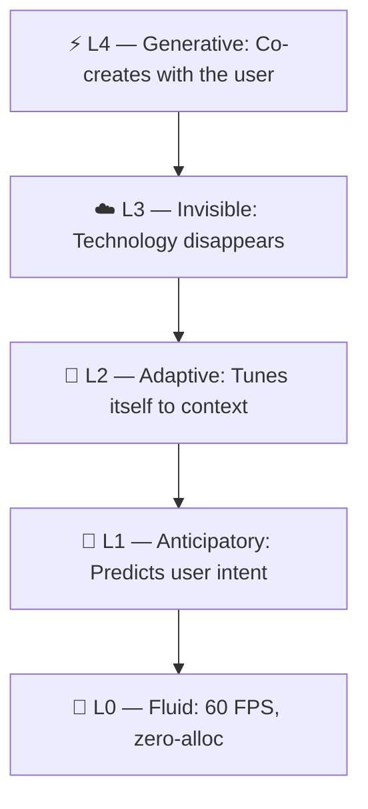
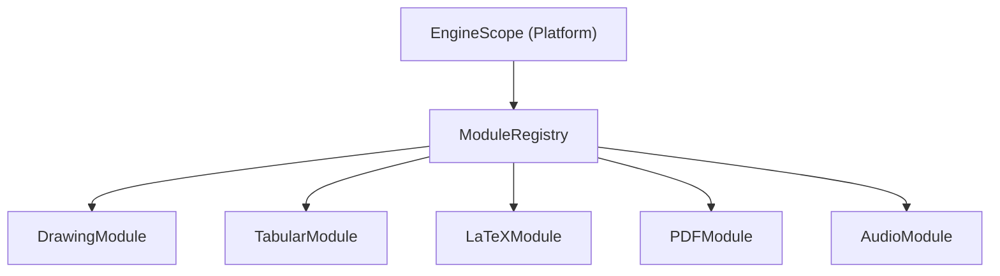

# Scene Graph Engine — Architecture

Motore 2D professionale costruito in 6 fasi incrementali, 100% retrocompatibile.

---

## Directory Structure

```
├── core/              ← Fondamenta
│   ├── canvas_node.dart         Base astratta: transform, opacity, blend, hit-test
│   ├── canvas_node_factory.dart  Deserializzazione polimorfica da JSON
│   └── scene_graph.dart          Container root con lista LayerNode
│
├── nodes/             ← Tipi di nodo
│   ├── group_node.dart          Container con figli ordinati
│   ├── layer_node.dart          Layer = GroupNode + metadati legacy (adapter)
│   ├── shape_node.dart          Forme geometriche (rettangoli, cerchi, etc.)
│   ├── stroke_node.dart         Pennellate (ink strokes) con BrushEngine
│   ├── text_node.dart           Testo semplice (wraps DigitalTextElement)
│   ├── image_node.dart          Immagini raster
│   ├── clip_group_node.dart     Clipping masks (path clip / alpha mask)
│   ├── path_node.dart           Path vettoriali con fill/stroke/gradients
│   ├── rich_text_node.dart      Testo multi-span con paragrafi e text-on-path
│   ├── symbol_system.dart       Simboli riutilizzabili (definition + instance + registry)
│   ├── frame_node.dart          Auto Layout container (padding, spacing, constraints)
│   └── advanced_mask_node.dart  Maschere avanzate (6 tipi: alpha, intersection, exclusion, luminance, silhouette)
│
├── vector/            ← Editing vettoriale
│   ├── vector_path.dart         Segmenti Bézier (line, quad, cubic)
│   ├── anchor_point.dart        Punti di ancoraggio con handle di controllo
│   ├── shape_presets.dart       11 forme predefinite (stella, poligono, freccia, etc.)
│   └── boolean_ops.dart         Operazioni booleane (union, subtract, intersect, XOR)
│
├── effects/           ← Effetti non-distruttivi
│   ├── node_effect.dart         5 effetti: Blur, DropShadow, InnerShadow, OuterGlow, ColorOverlay
│   ├── gradient_fill.dart       3 tipi: Linear, Radial, Conic con color stops
│   ├── mesh_gradient.dart       Mesh gradient N×M con Coons patch e tessellazione
│   └── shader_effect.dart       GPU shader system (8 preset, uniforms, ShaderNode)
│
├── systems/           ← Sistemi standalone
│   ├── smart_snap_engine.dart   6 tipi di snap: bordi, centri, distribuzione, griglia, angolo, dimensione
│   ├── animation_timeline.dart  Keyframes, tracks, timeline con interpolazione e 5 curve di easing
│   ├── command_history.dart     Undo/redo con Command pattern, coalescing, batch
│   ├── selection_manager.dart   Multi-selezione, aggregate bounds, group transforms, allineamento
│   ├── export_pipeline.dart     Esportazione PNG/JPEG/WebP/SVG/PDF
│   ├── dirty_tracker.dart       Dirty tracking con propagazione a parent, minimal repaint region
│   ├── spatial_index.dart       R-tree per viewport culling O(log n) e hit testing
│   ├── style_system.dart        Design tokens (colori, tipografia, spacing) + stili riutilizzabili con linking
│   ├── prototype_flow.dart      Prototyping: link, transizioni, trigger, schermate, flow navigation
│   ├── plugin_api.dart          Plugin/extension API con capabilities, sandbox, registry
│   ├── accessibility_tree.dart  Accessibility tree con 15 ruoli semantici, reading order, focus
│   ├── dev_handoff/             Dev Handoff / Inspect Mode
│   │   ├── inspect_engine.dart     Ispezione nodi: posizione, dimensioni, fill, stroke, tipografia
│   │   ├── code_generator.dart     Generazione codice Flutter/CSS/SwiftUI
│   │   ├── token_resolver.dart     Risoluzione proprietà → design token
│   │   ├── asset_manifest.dart     Manifest degli asset per export
│   │   └── redline_overlay.dart    Annotazioni dimensionali e spacing
│   ├── component_state_machine.dart  Macchina stati interattivi (hover, pressed, disabled)
│   ├── component_state_resolver.dart Risoluzione cascata stato + override istanza
│   ├── semantic_token.dart          Alias semantici per design token con chain resolution
│   ├── theme_manager.dart           Gestione temi con switching e scaffolding
│   ├── spring_simulation.dart       Simulazione fisica molle (critically/under/over damped)
│   ├── path_motion.dart             Moto lungo path Bézier con parametrizzazione arc-length
│   ├── stagger_animation.dart       Animazioni staggerate (sequential, reverse, fromCenter, fromEdges)
│   ├── variable_font.dart           Configurazione font variabili (weight, width, slant, optical size)
│   ├── opentype_features.dart       Feature OpenType (ligature, small caps, fractions, tabular nums)
│   ├── text_auto_resize.dart        Auto-resize testo (fixed, autoWidth, autoHeight, autoAll)
│   ├── image_adjustment.dart        Regolazioni immagine non-distruttive (brightness, contrast, saturation, hue, exposure, temperature)
│   └── image_fill_mode.dart         Modalità fill immagine (fill, fit, crop, tile, stretch) con transform matrix
│
└── renderers/         ← Rendering del scene graph
    ├── scene_graph_renderer.dart Traversal ricorsivo con compositing, effetti, viewport culling
    ├── path_renderer.dart        Rendering path vettoriali (fill + stroke + gradient)
    └── rich_text_renderer.dart   Layout e painting testo ricco via TextPainter
```

---

## Fasi di Implementazione

### Fase 1 — Scene Graph + Transform System
- `CanvasNode` base astratta con transform gerarchico (`Matrix4`)
- Hit testing con matrice inversa, bounds locali/mondiali
- `GroupNode`, `LayerNode`, `ShapeNode`, `StrokeNode`, `TextNode`, `ImageNode`
- `SceneGraph` root container, `CanvasNodeFactory` per deserializzazione
- Adapter `CanvasLayer` ↔ `LayerNode` per retrocompatibilità

### Fase 2 — Compositing + Gradients
- `GradientFill` con 3 tipi (linear, radial, conic) e color stops illimitati
- `ClipGroupNode` con path clip e alpha mask
- Compositing integrato nel renderer (opacity, blend mode, saveLayer)

### Fase 3 — Vector Path Editing
- `VectorPath` con segmenti Bézier (linea, quadratica, cubica)
- `AnchorPoint` con handle di controllo (mirrored, free, auto-smooth)
- `PathNode` con fill/stroke indipendenti + gradient shader
- `ShapePresets`: 11 forme parametriche
- `PathRenderer` per rendering vettoriale

### Fase 4 — Non-Destructive Effects
- `NodeEffect` base con 5 implementazioni concrete
- Stack di effetti per nodo (`List<NodeEffect>` su `CanvasNode`)
- Pre-effects (DropShadow, OuterGlow) e post-effects (Blur, ColorOverlay, InnerShadow)
- Serializzazione/deserializzazione completa

### Fase 5 — Rich Text + Smart Snapping
- `RichTextNode` con spans multi-stile, proprietà paragrafo, text-on-path
- `RichTextRenderer` con TextPainter e background fill
- `SmartSnapEngine` con 6 tipi di snap e soglia configurabile

### Fase 6 — Symbols, Animation, Multi-thread Rendering
- **Symbols**: `SymbolDefinition` (master) + `SymbolInstanceNode` (istanza con overrides) + `SymbolRegistry`
- **Animation**: `Keyframe` + `AnimationTrack` + `AnimationTimeline` + `PropertyInterpolator` con 5 curve di easing
- **Multi-thread**: `RenderTask` + `TileCache` LRU + `RenderIsolatePool` (architettura pronta per Isolate spawning)

### Fase 7 — Professional Core Features
- **Undo/Redo**: `Command` pattern con `CommandHistory` (undo/redo illimitato, coalescing per drag, batch commands). 10 comandi concreti (Move, Position, Transform, Add, Delete, Reorder, PropertyChange, Opacity, Visibility, Lock)
- **Multi-Selezione**: `SelectionManager` con aggregate bounds, group transforms (translate/rotate/scale), marquee select, 6 allineamenti, distribuzione H/V, filtri per tipo
- **Boolean Ops**: Union, subtract, intersect, XOR via `Path.combine`. Path overlap detection, multi-path flatten, Flutter Path → VectorPath conversion
- **Auto Layout**: `FrameNode extends GroupNode` con `LayoutConstraint` per figlio (fill/fixed/hug, pin, flex-grow). Layout solver 3-pass con main/cross axis alignment e space distribution
- **Export Pipeline**: PNG (1x/2x/3x DPI), JPEG (quality 0-100), WebP (quality 0-100), SVG (scene graph → SVG DOM), PDF (vector, custom PDF 1.4 writer). Export per nodo singolo, selezione, o intero scene graph

### Fase 8 — Performance & Design Systems
- **Dirty Tracking**: `DirtyTracker` con propagazione a parent, old-bounds tracking, dirty region computation (minimal repaint rect), per-layer dirty checking
- **Spatial Index**: R-tree con insert/remove/update, range query O(log n) per viewport culling, point query per hit testing, K-nearest query
- **Style System**: `StyleDefinition` con fill/stroke/effects/typography, `StyleRegistry` con node linking bidirezionale. Design tokens: `ColorToken`, `TypographyToken`, `SpacingToken`. Detach support
- **Advanced Masks**: `AdvancedMaskNode` con 6 tipi (alpha, intersection, exclusion, luminance, inverted luminance, silhouette), inversione, feathering, expansion, preview mode con overlay

### Fase 9 — Advanced Features
- **Mesh Gradients**: `MeshGradient` con griglia N×M di `MeshControlPoint`, interpolazione bilineare per patch (Coons patch), tessellazione a sub-quad, rendering via Canvas
- **Prototyping**: `PrototypeLink` con 6 trigger (click, hover, drag, timer, keyPress, scroll), 13 transizioni (dissolve, slide, push, flip, scale, smart animate), `PrototypeFlow` con navigation graph
- **Plugin API**: `PluginManifest` con 12 capabilities e 3 livelli permesso, `PluginContext` sandboxed con capability guards, `PluginRegistry` con lifecycle completo (install/activate/deactivate/uninstall)
- **Accessibility**: `AccessibilityInfo` con 15 ruoli semantici, reading order, heading levels, custom actions. `AccessibilityTreeBuilder` → a11y tree parallelo al scene graph
- **GPU Shaders**: `ShaderEffect` con 8 preset (noise, voronoi, chromatic aberration, glitch, gradient map, pixelate, vignette, custom), `ShaderUniform` hierarchy (float/vec2/vec4/color), `ShaderNode` standalone

### Fase 10 — Integration & Hardening
- **Renderer Dispatch**: Aggiunto rendering per `ShaderNode`, `AdvancedMaskNode`, `FrameNode` (tutti 13 tipi ora supportati)
- **System Wiring**: `SpatialIndex` e `DirtyTracker` integrati in `SceneGraph` con auto-registrazione nodi
- **Cached WorldTransform**: `worldTransform` cachato O(1) con dirty invalidation
- **SVG Export**: `PathNode` → `<path>`, `RichTextNode` → `<text>` con `<tspan>`, `ShapeNode`, `TextNode`
- **Clone**: `CanvasNode.clone()` via JSON roundtrip con ID univoco
- **Schema Version**: `version: 1` in `SceneGraph.toJson()`
- **Accessibility**: `accessibilityInfo` tipizzato `AccessibilityInfo?` con serializzazione

### Fase 11 — Polishing & Completeness
- **ShaderEffect Stack**: `ShaderEffectWrapper extends NodeEffect` per shader nel effect stack, dispatch in `fromJson`
- **MeshGradient Wiring**: `MeshGradient?` su `ShapeNode` con serializzazione
- **SceneGraph Integration**: `AnimationTimeline` e `PrototypeFlow` integrati in `SceneGraph.toJson/fromJson`
- **Barrel Export**: `scene_graph_engine.dart` — singolo import per tutto il motore
- **Code Quality**: Fix annotazioni `@override`, cleanup lint

### Fase 12 — Design System Completeness
- **Dev Handoff**: `InspectEngine` per ispezione nodi, `CodeGenerator` per generazione Flutter/CSS/SwiftUI, `TokenResolver` per mapping proprietà → token, `AssetManifest`, `RedlineCalculator` per annotazioni misure
- **Component States**: `ComponentStateMachine` con stati interattivi (hover, pressed, disabled, focused), `ComponentStateResolver` con cascata override (definition defaults → state map → instance overrides)
- **Semantic Tokens**: `SemanticTokenRegistry` con alias chaining, circular reference detection, validation. `ThemeManager` con switching temi, scaffolding light/dark, serializzazione
- **Physics Animation**: `SpringSimulation` con 3 regimi di smorzamento (critically/under/over damped), `MotionPath` con arc-length parametrization per moto costante, `StaggerAnimation` con 5 strategie di ordinamento
- **Typography**: `VariableFontConfig` con assi font variabili (wght, wdth, slnt, opsz, ital, GRAD), `OpenTypeConfig` con preset e merge, `TextAutoResizeEngine` con 4 modalità resize
- **Image Editing**: `ImageAdjustmentConfig` con 6 regolazioni non-distruttive (5×4 color matrix), `FillConfig` con 5 modalità fill e alignment/offset/scale

---

## Statistiche

| Metrica | Valore |
|---------|--------|
| File totali | 53 |
| LOC totali | ~18,000 |
| Tipi di nodo | 13 |
| Effetti | 6 + 8 shader preset |
| Forme preset | 11 |
| Tipi di snap | 6 |
| Curve di easing | 5 |
| Comandi undo/redo | 10 |
| Formati export | 6 + code gen (Flutter/CSS/SwiftUI) |
| Tipi di maschera | 6 |
| Design tokens | 3 + semantic alias + themes |
| Trigger prototyping | 6 |
| Transizioni | 13 |
| Plugin capabilities | 12 |
| Ruoli a11y | 15 |
| Physics animation | 3 (spring, path, stagger) |
| Font variable axes | 6 preset |
| Image adjustments | 6 (brightness, contrast, saturation, hue, exposure, temperature) |
| Unit tests | 348 |

---

## 🧠 Conscious Architecture — Beyond Fluidity

The engine operates at **five levels of intelligence**, from raw performance to creative co-authoring.



### L0 — Fluid (Complete)
8-subsystem pipeline: tile cache, frame budget, LOD, predictive stroke, gesture coalescing, chunked raster, adaptive 1€ filter, isolate raster.

### L1 — Anticipatory
| Subsystem | File |
|-----------|------|
| Directional Prefetch | `anticipatory_tile_prefetch.dart` |
| LOD Batch Precompute | `lod_manager.dart` |
| Stroke Prediction | `predictive_renderer.dart` |

### L2 — Adaptive
| Subsystem | File |
|-----------|------|
| Behavior Profile | `adaptive_profile.dart` |
| Reactivity Curve | `one_euro_filter.dart` |
| Refresh Rate Detection | `frame_budget_manager.dart` |
| Memory Pressure | `frame_budget_manager.dart` |
| Liquid Physics | `liquid_canvas_config.dart` |

### L3 — Invisible
| Subsystem | File |
|-----------|------|
| Smart Snap | `smart_snap_engine.dart` |
| Smart Animate | `smart_animate_engine.dart` |
| Plugin Sandbox | `plugin_api.dart` |
| Content Radar | `content_radar_overlay.dart` |
| Accessibility | `accessibility_bridge.dart` |

### L4 — Generative
| Subsystem | File |
|-----------|------|
| LaTeX Recognizer | `onnx_latex_recognizer.dart` |
| Design Linter | `design_linter.dart` |
| Style Coherence | `style_coherence_engine.dart` |

### Contract & Registry

All intelligence subsystems implement `IntelligenceSubsystem` (see `lib/src/core/conscious_architecture.dart`). The `ConsciousArchitecture` registry coordinates lifecycle via `onContextChanged()` and `onIdle()`.

Adding a new subsystem: create class → declare layer/name → implement lifecycle → register in `EngineScope`.

---

## 📦 Module System — Platform + Plugins

L'engine usa un'architettura **platform + modules** dove `EngineScope` è la piattaforma e i sottosistemi funzionali sono moduli plugin indipendenti.

### Architettura



### Contratto `CanvasModule`

```dart
abstract class CanvasModule {
  String get moduleId;
  String get displayName;
  List<NodeDescriptor> get nodeDescriptors;  // node types owned
  List<DrawingTool> createTools();            // tools provided
  Future<void> initialize(ModuleContext ctx);
  Future<void> dispose();
}
```

### Moduli registrati

| Modulo | ID | Node Types | Servizi |
|--------|----|-----------|---------|
| `DrawingModule` | `drawing` | `StrokeNode` | BrushSettings, Shaders, StrokePersistence |
| `TabularModule` | `tabular` | `TabularNode` | SpreadsheetModel, Evaluator, TabularLatexBridge |
| `LaTeXModule` | `latex` | `LatexNode` | Unified recognizer: ONNX → HME → Pix2Tex |
| `PDFModule` | `pdf` | `PdfPageNode`, `PdfDocumentNode` | On-demand controllers |
| `AudioModule` | `audio` | — | NativeAudioPlayer, NativeAudioRecorder |

### Factory a due livelli

`CanvasNodeFactory.fromJson()` usa un lookup a due livelli:
1. **Tier 1 (Dynamic)**: `ModuleRegistry.createNodeFromJson()` — cerca nei `NodeDescriptor` registrati
2. **Tier 2 (Hardcoded)**: switch/case legacy per nodi core (group, layer, etc.)

Nuovi moduli possono registrare node types senza toccare la factory.

### Inizializzazione

```dart
final scope = EngineScope();
EngineScope.push(scope);
await scope.initializeModules();  // registra tutti i 5 moduli built-in
```

### Accessor di convenienza

```dart
scope.drawingModule   // DrawingModule?
scope.tabularModule   // TabularModule?
scope.latexModule     // LaTeXModule?
scope.pdfModule       // PDFModule?
scope.audioModule     // AudioModule?
```

### Aggiungere un nuovo modulo

1. Creare `class MyModule extends CanvasModule`
2. Implementare `moduleId`, `nodeDescriptors`, `createTools()`, `initialize()`, `dispose()`
3. Registrare in `initializeModules()` dentro `EngineScope`
4. Aggiungere barrel export in `fluera_engine.dart`
