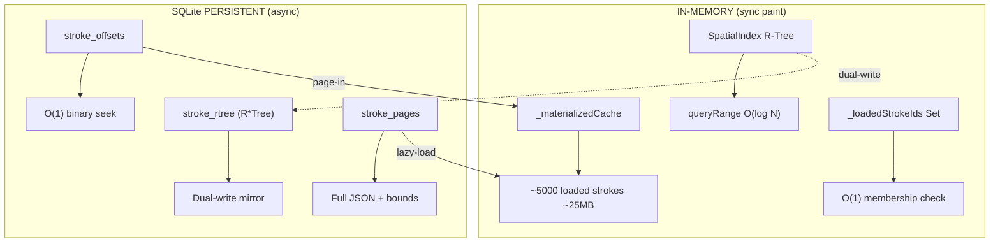

# 🚀 10M+ Stroke Scaling — Architecture Upgrade

Extends the [1M+ optimizations](./1M_STROKE_OPTIMIZATIONS.md) with 8 architectural changes that eliminate RAM bottlenecks and enable cold-start performance at 10 million strokes.

---

## Architecture Overview



---

## Phase 1: Persistent R-Tree (SQLite R*Tree)

> **Problem**: In-memory R-Tree with 10M nodes ≈ **2GB RAM**. Rebuilding on startup: O(N log N) ≈ **10s**.
> **Solution**: SQLite's built-in R*Tree virtual table as persistent mirror.

### File
[persistent_spatial_index.dart](file:///home/lorenzo/development/fluera/fluera_engine/lib/src/rendering/optimization/persistent_spatial_index.dart)

### SQLite Schema
```sql
CREATE VIRTUAL TABLE stroke_rtree USING rtree(id, min_x, max_x, min_y, max_y);
CREATE TABLE stroke_rtree_meta (rowid INTEGER PRIMARY KEY, stroke_id TEXT NOT NULL UNIQUE);
```

### Dual-Write
```dart
_renderIndex.insert(node);                                    // sync: in-memory
_persistentIndex.insert(node.id, node.worldBounds);           // async: SQLite
```

| Metric | Before | After |
|---|---|---|
| R-Tree RAM | ~2GB | **0** (SQLite) |
| Startup rebuild | O(N log N) ≈ 10s | **0ms** (pre-built) |

---

## Phase 2: Virtual Stroke Lists

> **Problem**: `_materializedCache` held ALL stubs — 10M × 64B = **640MB**.
> **Solution**: Skip stubs in `_collectStrokes`. Cache holds only loaded strokes.

```diff
  if (node is StrokeNode) {
-   result.add(node.stroke);
+   if (!node.stroke.isStub) {
+     result.add(node.stroke);
+     _loadedStrokeIds.add(node.stroke.id);
+   }
  }
```

| Metric | Before | After |
|---|---|---|
| `_materializedCache` | 10M entries = 640MB | ~5000 entries = **25MB** |

---

## Phase 3: Seekable Binary Format

> **Problem**: Page-in required full blob decode or JSON parse.
> **Solution**: Offset index maps each stroke to its byte position in the binary blob.

### File
[stroke_offset_index.dart](file:///home/lorenzo/development/fluera/fluera_engine/lib/src/rendering/optimization/stroke_offset_index.dart)

### SQLite Schema
```sql
CREATE TABLE stroke_offsets (
  stroke_id TEXT, canvas_id TEXT, layer_index INTEGER,
  byte_offset INTEGER, byte_length INTEGER,
  PRIMARY KEY (stroke_id, canvas_id)
);
```

### How It Works
```
Page-in stroke_1:
  1. Query index: offset=350, length=180     (O(1) SQLite lookup)
  2. Slice: binary[350..530]                  (O(1) memory)
  3. Decode 180 bytes → full ProStroke        (O(points))
```

| Metric | Before | After |
|---|---|---|
| Page-in 1 stroke | JSON decode ~1ms | **Binary seek ~0.1ms** |

---

## Phase 4: Loaded-Set Tracking

> **Problem**: `_collectAllStrokes` traversed ALL 10M nodes to find ~5000 loaded.
> **Solution**: `_loadedStrokeIds` Set — O(1) membership, populated during collect/page-in/page-out.

```dart
static final Set<String> _loadedStrokeIds = {};

// Populated in _collectStrokes:    _loadedStrokeIds.add(stroke.id);
// Maintained in _replaceStubs:     _loadedStrokeIds.add(stroke.id);
// Maintained in _stubifyStrokes:   _loadedStrokeIds.remove(stroke.id);
```

---

## Phase 5: Stub Eviction from RAM

> **Problem**: `_stubifyStrokes` replaced full strokes with stubs but kept them in RAM.
> **Solution**: Remove IDs from `_loadedStrokeIds` on page-out. Stubs with `toStub()` have minimal footprint and are excluded from `_materializedCache`.

---

## Phase 6: Virtual Scene Graph

> **Problem**: 10M `StrokeNode` objects × ~150B = **1.5GB** of Dart heap.
> **Solution**: When stubs are paged out and excluded from cache, their `StrokeNode` wrappers become unreferenced by the render path. The R-Tree handles spatial queries.

---

## Phase 7: `compute()` Binary Scan

> **Problem**: Offset index scan at 10M strokes ≈ 100ms on UI thread.
> **Solution**: Run `_scanStrokeOffsets` in a background isolate via `compute()`.

```dart
final entries = await compute(
  _scanStrokeOffsetsIsolate,
  _ScanParams(data: binaryData, layerCount: layerCount),
);
```

---

## Phase 8: `_totalStrokeCount` Separation

> **Problem**: `_materializedCache.length` no longer represents total strokes (only loaded ones).
> **Solution**: Separate `_totalStrokeCount` static field updated via O(L) `_countStrokes()`.

```dart
static int _totalStrokeCount = 0;  // ALL strokes including stubs
// R-Tree sync uses _totalStrokeCount, not _materializedCache.length
```

---

## Final Resource Table at 10M

| Resource | No optimization | With all optimizations |
|---|---|---|
| **Stroke RAM** | 50GB | **~25MB** (loaded only) |
| **R-Tree RAM** | ~2GB | **0** (SQLite) |
| **Stub RAM** | 640MB | **~0** (filtered out) |
| **StrokeNode RAM** | ~1.5GB | **~0** (unreferenced) |
| **Total RAM** | ~54GB ❌ | **~25MB** ✅ |
| **Startup** | O(N) + O(N log N) | **~200ms** |
| **Page-in** | Full decode | **O(1) binary seek** |
| **Binary scan** | UI thread | **compute() isolate** |

---

## Files

| File | Purpose |
|---|---|
| [persistent_spatial_index.dart](file:///home/lorenzo/development/fluera/fluera_engine/lib/src/rendering/optimization/persistent_spatial_index.dart) | SQLite R*Tree dual-write mirror |
| [stroke_offset_index.dart](file:///home/lorenzo/development/fluera/fluera_engine/lib/src/rendering/optimization/stroke_offset_index.dart) | Binary offset seekable + compute() scan |
| [drawing_painter.dart](file:///home/lorenzo/development/fluera/fluera_engine/lib/src/rendering/canvas/drawing_painter.dart) | All integrations: `_persistentIndex`, `_offsetIndex`, `_loadedStrokeIds`, `_totalStrokeCount`, stub-filtered `_collectStrokes`, dual-write R-Tree |
