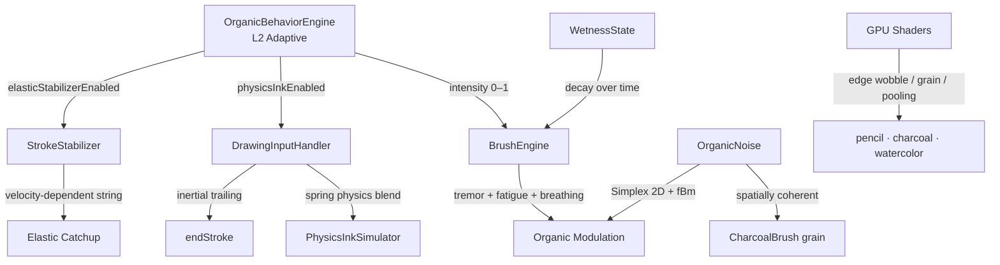

# 🌱 Emergent Organicity — Documentazione Tecnica

Il motore Nebula Engine integra un sistema di **organicità emergente** che introduce comportamenti naturali, non-lineari e biologicamente plausibili nel rendering dei tratti. L'obiettivo è eliminare la "perfezione digitale" e rendere ogni tratto vivo come se fosse disegnato su carta vera.

---

## Architettura



Tutto è coordinato da `OrganicBehaviorEngine`, un subsystem L2 della Conscious Architecture. Quando l'intensità è 0 (selezione, PDF, shape tool), nessun codice organico viene eseguito — **zero overhead**.

---

## §1 — Micro-Variazione Biologica

**File:** `lib/src/drawing/brushes/brush_engine.dart` → `_applyOrganicModulation()`

Ogni punto dello stroke viene modulato con tre segnali biologici sovrapposti:

| Segnale | Frequenza | Ampiezza | Effetto |
|---------|-----------|----------|---------|
| **Tremor 1/f** | Multi-freq (3–25 Hz equiv.) | ±0.3px laterale, ±5% pressione | Simula il micro-tremito naturale della mano |
| **Fatica muscolare** | Dopo 200 punti | +30% ampiezza a 500pts | I tratti lunghi diventano leggermente più tremolanti |
| **Respirazione** | ~0.2 Hz (periodo ~1000px arco) | ±1.5% pressione | Modulazione ultra-lenta simile al respiro |

**Caratteristiche chiave:**
- L'ampiezza del tremor è **inversamente proporzionale alla velocità** — movimenti lenti = più tremito (come nella realtà)
- I punti estremi (primo e ultimo) sono preservati per non alterare gli endpoint dello stroke
- Il seed del noise è deterministico per-stroke (posizione del primo punto)

---

## §2 — Wetness Live Rendering

**File:** `lib/src/drawing/brushes/brush_engine.dart`

Il canvas mantiene uno stato di **bagnatura** (`WetnessState`) che:
1. Viene incrementato quando si usa un pennello ad acqua (watercolor, ink wash)
2. Decade esponenzialmente nel tempo (asciugatura naturale)
3. Viene passato a `SurfaceMaterial.computeModifiers()` per influenzare assorbimento e spread

Questo permette alla sequenza temporale dei tratti di influenzare il rendering: tratti sovrapposti ad aree ancora "bagnate" avranno più diffusione e blending di colore.

---

## §3 — PhysicsInkSimulator nella Pipeline

**File:** `lib/src/drawing/input/drawing_input_handler.dart`

Il `PhysicsInkSimulator` (modello molla-smorzatore) è ora inserito nella pipeline di input attiva:

```
PointerEvent → OneEuroFilter → PhysicsInkSimulator → StrokeStabilizer → ProDrawingPoint
                                     ↓ (blend 15%)
                               Posizione filtrata
```

- **Blend factor:** 15% — il tratto segue la penna al 85% e la simulazione fisica al 15%
- **Inertial trailing:** su `endStroke()`, vengono aggiunti 3 punti simulati con pressione decrescente per creare un'uscita naturale invece di un taglio netto
- **Reset automatico** su ogni nuovo stroke

---

## §4 — Noise Frattale Coerente (CPU)

**File:** `lib/src/drawing/brushes/charcoal_brush.dart`

`Random(42)` → `OrganicNoise.simplexNoise2D()`:
- **Prima:** le particelle di grana erano distribuite casualmente senza correlazione spaziale — stessa grana ovunque
- **Ora:** ogni posizione del canvas ha una grana unica ma coerente — punti vicini hanno grane simili, creando pattern naturali come quelli della carta vera

---

## §5 — Stabilizzatore Elastico Adattivo

**File:** `lib/src/drawing/filters/stroke_stabilizer.dart`

Il "string pulling" ora ha una corda **elastica**:

| Velocità | Lunghezza corda | Comportamento |
|----------|-----------------|---------------|
| 0 px/s | 100% (base) | Massimo smoothing per dettagli fini |
| 600 px/s | 70% | Smoothing moderato |
| 1200+ px/s | 40% (minimo) | Massima reattività per gesti veloci |

Il catchup usa una curva **Hermite smoothstep** (easeInOut) invece di lineare, per transizioni più fluide tra accelerazione e decelerazione.

---

## §6 — GPU Shader Organicity

### `pencil_pro.frag` — Edge Wobble
Il contorno della matita è perturbato da noise a bassa frequenza, creando bordi leggermente irregolari come il grafite su carta ruvida.

### `charcoal.frag` — Grana Anisotropica
- La frequenza della grana varia con la pressione: pressione leggera = grana grossa, pressione forte = grana fine
- La grana segue la **direzione del tratto** (anisotropia) — il carbone lascia segni allineati al movimento

### `watercolor.frag` — Cauliflower Pooling
Il pigmento si accumula in modo irregolare ai bordi (effetto "cavolfiore"), con concentrazioni variabili guidate da noise. Simula il comportamento reale dell'acquarello dove il pigmento migra verso i bordi durante l'asciugatura.

---

## §7 — OrganicBehaviorEngine

**File:** `lib/src/systems/organic_behavior_engine.dart`

Subsystem L2 della Conscious Architecture che coordina tutto:

```dart
// Accesso statico zero-cost da qualsiasi punto
if (OrganicBehaviorEngine.tremorEnabled) { ... }
if (OrganicBehaviorEngine.physicsInkEnabled) { ... }
if (OrganicBehaviorEngine.elasticStabilizerEnabled) { ... }
```

**Regole di gating:**
- `isDrawing = true` → intensity 1.0 (sempre piena durante il disegno)
- Tool non-disegno (lasso, shape) → intensity 0.0
- PDF → intensity 0.0
- Zoom < 0.3 e non disegno → intensity 0.0 (dettaglio invisibile)

---

## 🚀 Ottimizzazioni Performance

| Miglioramento | Impatto | Dove |
|---------------|---------|------|
| Pre-allocated `_organicPointsBuffer` | Zero allocazioni heap per frame | `BrushEngine._applyOrganicModulation()` |
| Point-derived timestamp | Elimina syscall `DateTime.now()` dal render loop | `BrushEngine.renderStroke()` |
| Optional `timestampUs` parameter | Elimina syscall `DateTime.now()` dallo stabilizer | `StrokeStabilizer.stabilize()` |
| Per-brush zero-blend fast path | `ballpoint`/`highlighter` skippano completamente PhysicsInk | `DrawingInputHandler` |

---

## 🎨 Profili Organici Per-Brush

Ogni pennello ha un profilo fisico che determina il suo comportamento organico:

### Tremor & Respirazione (_applyOrganicModulation)

| Brush | Ampiezza | Freq × | Carattere |
|-------|----------|--------|----------|
| ✏️ Pencil | 0.25px | 1.3× | Fine, alta frequenza (grafite rigida) |
| ✒️ Fountain | 0.35px | 0.8× | Fluido, media freq (pennino flessibile) |
| 🖤 Charcoal | 0.50px | 0.6× | Ruvido, bassa freq (stick morbido) |
| 🎨 Watercolor | 0.40px | 0.7× | Fluido, organico (pennello ad acqua) |
| 🖊️ Ballpoint | 0.10px | 1.5× | Minimo, alta freq (meccanismo rigido) |
| ✨ Neon Glow | 0.15px | 1.2× | Quasi nullo (effetto digitale) |
| ☁️ Spray Paint | 0.60px | 0.5× | Forte, bassa freq (bomboletta) |

### PhysicsInk (DrawingInputHandler)

| Brush | Blend | Trailing | Comportamento |
|-------|-------|----------|---------------|
| Fountain | 25% | 5 punti | Massima inerzia — tratto fluido e sinuoso |
| Charcoal | 20% | 3 punti | Inerzia moderata — stick si trascina |
| Watercolor | 20% | 3 punti | Pennello si spande naturalmente |
| Ink Wash | 18% | 4 punti | Inchiostro scorre con gravità |
| Pencil | 12% | 2 punti | Leggera inerzia — grafite scivola |
| Ballpoint | 0% | 0 punti | Zero inerzia — preciso e meccanico |
| Highlighter | 0% | 0 punti | Zero inerzia — strumento rigido |

---

## OrganicNoise — Utility Foundation

**File:** `lib/src/drawing/filters/organic_noise.dart`

| Funzione | Input | Output | Uso |
|----------|-------|--------|-----|
| `simplexNoise2D(x, y)` | coordinate 2D | [-1, 1] | Noise base per tutto |
| `fbm(x, y, octaves)` | coordinate + ottave | [-1, 1] | Texture multi-scala |
| `biologicalTremor(arc, velocity, seed)` | arco, velocità | [-1, 1] | Tremito mano |
| `fatigueFactor(pointCount)` | punti disegnati | [1.0, 1.3] | Affaticamento |
| `breathingModulation(arcLength)` | lunghezza arco | [-1, 1] | Respiro |

**Prestazioni:** O(1) per campione, zero allocazioni heap, tabella di permutazione pre-calcolata (256 entries).

---

## Test

```bash
# Noise e engine
flutter test test/drawing/filters/organic_noise_test.dart
flutter test test/systems/organic_behavior_engine_test.dart

# Regressione completa
flutter test test/drawing/ test/rendering/
```

Tutti i test passano ✅
